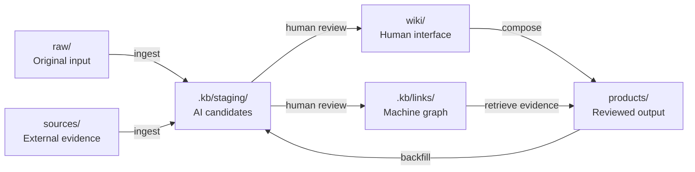
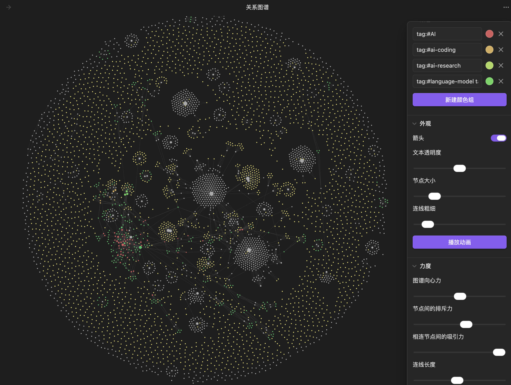

# AI Content Knowledge Base

[简体中文](README.zh-CN.md) | English

An open reference architecture for building an AI-assisted personal content knowledge system with Markdown, Obsidian, YAML sidecars, and a review-first workflow.

This project is not a collection of someone else's notes. It is a reusable vault skeleton that separates original thinking, external evidence, published work, human-readable knowledge pages, and machine-generated metadata.

> Core idea: originals stay trustworthy, the wiki stays readable, the graph stays queryable, and AI output stays reviewable.

## Why this project exists

A large content vault usually mixes several very different things:

- personal notes and judgments;
- external articles, papers, and transcripts;
- published articles, courses, and scripts;
- AI-generated summaries and drafts;
- indexes that help people navigate the collection.

Treating all of them as ordinary notes makes provenance and review status ambiguous. This template gives every file a clear role and keeps AI-generated bulk changes away from source material and publication workflows.

## Architecture

```text
raw/       original personal input
sources/   external, citable source material
products/  reviewed, published, or delivered output
wiki/      human-readable concepts, entities, maps, and source notes
.kb/       machine-readable graph, staging area, reports, and logs
```



See [Architecture](docs/ARCHITECTURE.md) for the design rationale.

## Quick start

```bash
git clone https://github.com/mrbear1024/ai-content-kb.git
cd ai-content-kb
```

Open the repository root as an Obsidian vault or use it as plain Markdown. For the intended agent workflow, also open it as a Codex project.

## Open the project in Codex

1. Open the Codex desktop app.
2. Select `+` in the `Projects` area.
3. Choose `Use an existing folder`.
4. Select the cloned `ai-content-kb` root, not one of its subdirectories.
5. Start a new task inside that project.
6. For a first-run check, say: `Inspect the project structure, read the knowledge-base rules, make no changes, and list the available workflows.`

Codex reads repository `AGENTS.md` guidance before it starts work. This repository's root instructions then direct Codex to the remaining knowledge-base documentation, giving new tasks the same boundaries and workflows. [Read the official Codex documentation](https://learn.chatgpt.com/docs/agent-configuration/agents-md).

> Phrases such as `加入知识库` and `add to knowledge base` are natural-language intents defined by this repository, not native Codex slash commands. No plugin is required.

## Natural-language workflows

| Prompt | Default behavior |
|---|---|
| `加入知识库：这是我的原创笔记` | Classify and store owner-authored input under `raw/`, then generate staged index candidates |
| `add to knowledge base: this attachment is an external source` | Store source material under `sources/`, record provenance, and generate staged candidates |
| `增加 Wiki 索引：刚才的材料` | Create cited wiki candidates in `.kb/staging/wiki/` and graph candidates in `.kb/staging/links/` |
| `review and publish index: <staging path>` | Validate citations, aliases, edges, and hashes before promotion |
| `query knowledge base: <question>` | Navigate wiki and graph, return to originals, and cite repository paths |
| `backfill knowledge base: <path>` | Analyze existing content without rewriting source or product bodies |
| `lint knowledge base` | Check paths, citations, aliases, hashes, and privacy risks |

## Recommended operating loop

1. Provide an attachment, repository path, text, or URL and identify its provenance when possible.
2. Use `加入知识库` / `add to knowledge base` to capture it.
3. Inspect candidates under `.kb/staging/wiki/`, `.kb/staging/links/`, and `.kb/staging/drafts/`.
4. Ask Codex to summarize uncertain names, citations, and relationships.
5. Use `审核并发布索引` / `review and publish index` only after human review.
6. Query or compose from reviewed knowledge, always returning to original evidence.
7. Run `检查知识库` / `lint knowledge base` after bulk imports or file moves.

## Codex best practices

- Keep one task focused on one goal: capture, index, review, query, or compose.
- State whether material is owner-authored, external, or already published.
- Provide concrete attachments, paths, or URLs.
- Review staging before promoting generated knowledge.
- Ask answers to distinguish owner judgment, external claims, published expression, and inference.
- Do not publicly commit copyrighted captures, private material, credentials, or local metadata.
- Commit each reviewed ingest or wiki update as a coherent Git change.

## Explore the graph in Obsidian

If you use Obsidian, open this project directly as a vault:

1. Start Obsidian and choose `Open folder as vault`.
2. Select the cloned `ai-content-kb` root.
3. Select `Graph view` in the left ribbon.
4. Use the graph settings to adjust filters, color groups, arrows, node size, and forces.

The included `.obsidian/graph.json` groups nodes by content role: `raw/`, `sources/`, `products/`, and `wiki/`.



> This screenshot shows a mature vault that has accumulated substantial content using the same architecture. A fresh clone contains only a few example nodes; clusters and connections emerge as notes, reviewed wiki links, and tags grow.

### Two complementary graph layers

| Layer | Location | Purpose |
|---|---|---|
| Obsidian visual graph | Markdown links, `[[wikilinks]]`, and tags | Human navigation, clusters, and orphan discovery |
| Machine relationship graph | `.kb/links/*.yaml` | Typed edges, evidence, confidence, hashes, and review status for agents and scripts |

YAML edges do not automatically appear as Obsidian graph lines. Add ordinary Markdown links or `[[wikilinks]]` to reviewed wiki pages when a high-value relationship should also be visible to people.

## Manual workflow

Without Codex, read [START_HERE.md](START_HERE.md), add original notes under `raw/notes/`, add sources under `sources/clips/`, follow [AGENTS.md](AGENTS.md), and review generated candidates before promotion.

The included example shows how a source can explain a concept without changing either original file:

- source: `sources/clips/example-source.md`;
- concept: `wiki/concepts/Example Concept.md`;
- graph sidecar: `.kb/links/sources/example-source.yaml`.

## The review boundary

```text
unreviewed AI drafts        -> .kb/staging/drafts/
unreviewed relationship data -> .kb/staging/links/
human-developed drafts      -> raw/drafts/
reviewed knowledge pages    -> wiki/
reviewed relationship data  -> .kb/links/
reviewed publishable work   -> products/
```

The deciding factors are review status, intended use, human ownership, and publication readiness—not whether AI helped write the text.

## Repository map

```text
.
├── AGENTS.md
├── CLAUDE.md
├── START_HERE.md
├── KNOWLEDGE_BASE_GUIDE.md
├── README.md
├── README.zh-CN.md
├── LICENSE
├── .obsidian/
│   └── graph.json
├── docs/
│   ├── assets/
│   │   └── obsidian-graph-view.png
│   ├── ARCHITECTURE.md
│   ├── GRAPH_SCHEMA.md
│   └── PUBLIC_RELEASE_CHECKLIST.md
├── raw/
│   ├── notes/
│   ├── voice/
│   ├── research/
│   └── drafts/
├── sources/
│   ├── clips/
│   ├── papers/
│   ├── books/
│   ├── reports/
│   └── media/
├── products/
│   ├── articles/
│   ├── courses/
│   └── media/
├── wiki/
│   ├── concepts/
│   ├── entities/
│   ├── maps/
│   └── sources/
└── .kb/
    ├── links/
    │   ├── raw/
    │   ├── sources/
    │   ├── products/
    │   ├── concepts/
    │   └── entities/
    ├── staging/
    │   ├── wiki/
    │   ├── drafts/
    │   ├── course-drafts/
    │   └── links/
    ├── reports/
    ├── logs/
    └── metadata/
```

## What this repository does not claim

- It is a reference template, not a finished knowledge-management application.
- Obsidian is optional; the storage model is ordinary files.
- YAML sidecars are the first graph representation, not a requirement to avoid databases forever.
- AI-generated pages are not automatically trustworthy.
- More links and more pages are not success metrics by themselves.

## Success criteria

A useful implementation should answer questions such as:

- Which sources merely mention a concept, and which explain it?
- Which published works used a particular idea?
- Is a claim based on personal judgment or external evidence?
- Which course chapters cover a concept?
- Which source changed after its graph data was last reviewed?
- Can every important wiki statement be traced to an original file?

## Using product repositories

If articles or courses live in separate repositories, mount or reference them under `products/`. Do not hard-code personal absolute paths into public configuration. Document local mount setup in a private, ignored file such as `.kb/metadata/local-mounts.yaml`.

## Contributing

Improvements to the information model, graph schema, review workflow, examples, and lint rules are welcome. Do not submit private notes, copyrighted source captures, credentials, absolute home-directory paths, or generated databases containing personal metadata.

Before publishing a fork, use [the public release checklist](docs/PUBLIC_RELEASE_CHECKLIST.md).

## License

MIT. See [LICENSE](LICENSE).

This project is not affiliated with or endorsed by Obsidian.
