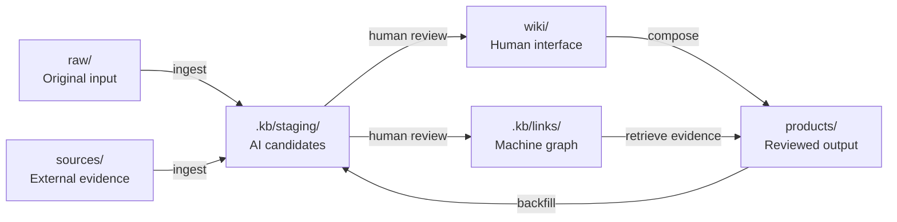

# AI Content Knowledge Base

[简体中文](README.zh-CN.md) | English

An open reference architecture for building an AI-assisted personal content knowledge system with Markdown, Obsidian, YAML sidecars, and a review-first workflow.

This project is not a collection of someone else's notes. It is a reusable vault skeleton that separates original thinking, external evidence, published work, human-readable knowledge pages, and machine-generated metadata.

> Core idea: originals stay trustworthy, the wiki stays readable, the graph stays queryable, and AI output stays reviewable.

## Why this project exists

A large content vault usually mixes several very different things:

- personal notes and judgments;
- external articles, papers, and transcripts;
- published articles, courses, and scripts;
- AI-generated summaries and drafts;
- indexes that help people navigate the collection.

Treating all of them as ordinary notes makes provenance and review status ambiguous. This template gives every file a clear role and keeps AI-generated bulk changes away from source material and publication workflows.

## Architecture

```text
raw/       original personal input
sources/   external, citable source material
products/  reviewed, published, or delivered output
wiki/      human-readable concepts, entities, maps, and source notes
.kb/       machine-readable graph, staging area, reports, and logs
```



See [Architecture](docs/ARCHITECTURE.md) for the design rationale.

## Quick start

1. Clone or copy this repository.
2. Open the repository root as an Obsidian vault, or use it as plain Markdown.
3. Read [START_HERE.md](START_HERE.md).
4. Add an original note under `raw/notes/`.
5. Add an external source under `sources/clips/`.
6. Ask an AI agent to ingest the files while following [AGENTS.md](AGENTS.md).
7. Review generated candidates under `.kb/staging/` before promoting them.

The included example shows how a source can explain a concept without changing either original file:

- source: `sources/clips/example-source.md`;
- concept: `wiki/concepts/Example Concept.md`;
- graph sidecar: `.kb/links/sources/example-source.yaml`.

## The review boundary

```text
unreviewed AI drafts        -> .kb/staging/drafts/
unreviewed relationship data -> .kb/staging/links/
human-developed drafts      -> raw/drafts/
reviewed knowledge pages    -> wiki/
reviewed relationship data  -> .kb/links/
reviewed publishable work   -> products/
```

The deciding factors are review status, intended use, human ownership, and publication readiness—not whether AI helped write the text.

## Repository map

```text
.
├── AGENTS.md
├── CLAUDE.md
├── START_HERE.md
├── KNOWLEDGE_BASE_GUIDE.md
├── README.md
├── README.zh-CN.md
├── LICENSE
├── docs/
│   ├── ARCHITECTURE.md
│   ├── GRAPH_SCHEMA.md
│   └── PUBLIC_RELEASE_CHECKLIST.md
├── raw/
│   ├── notes/
│   ├── voice/
│   ├── research/
│   └── drafts/
├── sources/
│   ├── clips/
│   ├── papers/
│   ├── books/
│   ├── reports/
│   └── media/
├── products/
│   ├── articles/
│   ├── courses/
│   └── media/
├── wiki/
│   ├── concepts/
│   ├── entities/
│   ├── maps/
│   └── sources/
└── .kb/
    ├── links/
    │   ├── raw/
    │   ├── sources/
    │   ├── products/
    │   ├── concepts/
    │   └── entities/
    ├── staging/
    │   ├── drafts/
    │   ├── course-drafts/
    │   └── links/
    ├── reports/
    ├── logs/
    └── metadata/
```

## What this repository does not claim

- It is a reference template, not a finished knowledge-management application.
- Obsidian is optional; the storage model is ordinary files.
- YAML sidecars are the first graph representation, not a requirement to avoid databases forever.
- AI-generated pages are not automatically trustworthy.
- More links and more pages are not success metrics by themselves.

## Success criteria

A useful implementation should answer questions such as:

- Which sources merely mention a concept, and which explain it?
- Which published works used a particular idea?
- Is a claim based on personal judgment or external evidence?
- Which course chapters cover a concept?
- Which source changed after its graph data was last reviewed?
- Can every important wiki statement be traced to an original file?

## Using product repositories

If articles or courses live in separate repositories, mount or reference them under `products/`. Do not hard-code personal absolute paths into public configuration. Document local mount setup in a private, ignored file such as `.kb/metadata/local-mounts.yaml`.

## Contributing

Improvements to the information model, graph schema, review workflow, examples, and lint rules are welcome. Do not submit private notes, copyrighted source captures, credentials, absolute home-directory paths, or generated databases containing personal metadata.

Before publishing a fork, use [the public release checklist](docs/PUBLIC_RELEASE_CHECKLIST.md).

## License

MIT. See [LICENSE](LICENSE).

This project is not affiliated with or endorsed by Obsidian.
