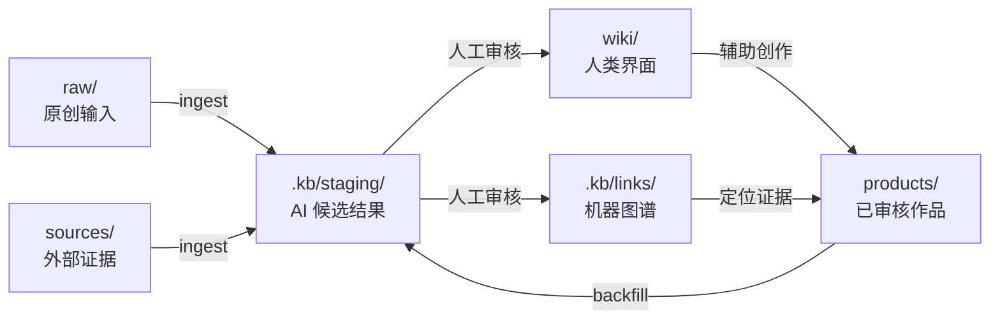

# AI Content Knowledge Base

简体中文 | [English](README.md)

一个基于 Markdown、Obsidian、YAML sidecar 和人工审核工作流的 AI 内容知识库参考架构。

它不是某个人公开出来的笔记合集，而是一套可复制的知识库骨架：将原创输入、外部证据、发布作品、人类知识索引和机器元数据分开管理。

> 核心思想：原文保持可信，Wiki 保持可读，图谱保持可查，AI 输出保持可审核。

## 为什么需要这套架构

大型内容库通常会混合多种性质完全不同的文件：

- 个人想法与判断；
- 外部文章、论文和转写；
- 已发布的文章、课程和脚本；
- AI 生成的总结与草稿；
- 帮助人理解和导航的知识索引。

如果把它们都当成普通笔记，观点归属、证据来源和审核状态就会变得模糊。这套模板为不同内容定义明确角色，并把 AI 批量输出隔离在事实源和发布流程之外。

## 总体架构

```text
raw/       个人原创输入
sources/   外部可引用材料
products/  已审核、已发布或已交付作品
wiki/      人类可读的概念、实体、地图和来源摘要
.kb/       机器图谱、待审核区、报告和日志
```



详细设计见 [架构说明](docs/ARCHITECTURE.md)。

## 快速开始

```bash
git clone https://github.com/mrbear1024/ai-content-kb.git
cd ai-content-kb
```

接下来可以将仓库根目录作为 Obsidian Vault 打开，也可以直接使用普通 Markdown 工具。推荐同时把它作为 Codex 项目使用。

## 在 Codex 中打开项目

1. 打开 Codex 桌面应用。
2. 在左侧 `Projects` 区域点击 `+`。
3. 选择 `Use an existing folder`。
4. 选择刚刚 clone 的 `ai-content-kb` 根目录，不要只选择其中的 `wiki/` 或 `raw/`。
5. 在该项目中新建一个任务。
6. 第一次可以输入：`检查项目结构，读取知识库规则，不做修改，并告诉我可用的操作。`

Codex 官方文档说明，它会在开始工作前读取仓库中的 `AGENTS.md`。本项目的 `AGENTS.md` 会进一步要求 Codex 读取 `START_HERE.md` 以及关联规则，因此每个新任务都能获得相同的知识库边界和工作流。[查看 Codex 官方说明](https://learn.chatgpt.com/docs/agent-configuration/agents-md)

> 「加入知识库」等是本仓库通过 `AGENTS.md` 定义的自然语言意图，不是 Codex 原生 slash command。直接输入即可，不需要安装插件。

## 可以直接对 Codex 说什么

| 你说 | Codex 应执行的默认工作流 |
|---|---|
| `加入知识库：这是我的一条原创笔记` | 判断来源角色，写入 `raw/`，生成待审核索引和关系 |
| `加入知识库：把这个附件作为外部来源保存` | 写入 `sources/`，记录来源，生成 staging 候选 |
| `增加 Wiki 索引：刚才加入的材料` | 从原文提取概念、实体和来源摘要，写入 `.kb/staging/wiki/` 与 `.kb/staging/links/` |
| `审核并发布索引：.kb/staging/wiki/...` | 校验引用、alias、边和 hash，再进入 `wiki/` 与 `.kb/links/` |
| `查询知识库：我有哪些关于 Context Engineering 的材料？` | 从 Wiki 定位，经图谱回到原文，并引用仓库路径 |
| `回填知识库：products/articles/` | 扫描旧内容，生成关系和报告，不修改正文 |
| `检查知识库` | 检查断链、缺失引用、重复 alias、hash 变化和隐私风险 |

如果输入只有一句 `加入知识库`，却没有附件、路径、URL 或正文，Codex 会询问要加入什么。

## 推荐使用流程

### 1. 收集材料

把文件拖入任务、给出文件路径或 URL，并告诉 Codex 它是“我的原创输入”还是“外部材料”。例如：

```text
加入知识库：这个附件是我今天的原创思考，主题是 AI Agent 的评估器设计。
```

### 2. 检查 staging

Codex 默认不会把 AI 生成结果直接当作正式知识。先查看：

```text
.kb/staging/wiki/
.kb/staging/links/
.kb/staging/drafts/
```

可以继续说：

```text
总结这次生成的候选索引，并指出需要我确认的概念命名、引用和关系。
```

### 3. 人工确认后发布

确认候选内容后再说：

```text
审核并发布索引：发布刚才生成的 Wiki 页面和关系；有疑问的项目继续保留在 staging。
```

### 4. 查询与创作

查询时要求回到原文：

```text
查询知识库：我对 Harness Engineering 有哪些个人判断？外部来源又有哪些？请分开回答并引用路径。
```

写作时先生成草稿，不直接进入 products：

```text
根据知识库中关于 Context Engineering 的材料生成文章大纲，注明可复用来源，写入 staging。
```

## Codex 使用最佳实践

- **一个任务只做一个目标**：采集、建索引、审核、查询和写作尽量分开。
- **明确来源身份**：告诉 Codex 内容是个人原创、外部材料还是已发布作品。
- **给出可定位输入**：优先提供附件、仓库路径或 URL，不要只说“处理一下这篇”。
- **先 staging 后发布**：先检查候选文件，再使用“审核并发布索引”。
- **让回答引用原文**：查询时要求区分个人判断、外部主张、已发布表达和 AI 推断。
- **不要把版权材料公开提交**：公开仓库优先保存元数据和原创摘要。
- **定期运行检查**：批量加入材料或移动文件后执行一次 `检查知识库`。
- **审核后再提交 Git**：把一次经过确认的 ingest 或 Wiki 更新作为一个独立 commit。

## 手动使用

不使用 Codex 时，也可以按以下方式操作：

1. 阅读 [START_HERE.md](START_HERE.md)。
2. 在 `raw/notes/` 中添加原创笔记。
3. 在 `sources/clips/` 中添加外部材料。
4. 按 [AGENTS.md](AGENTS.md) 中的 ingest 规则生成候选索引。
5. 审核 `.kb/staging/` 中的候选结果，再决定是否进入正式层。

仓库内置了一条完整的合成示例：

- 外部来源：`sources/clips/example-source.md`；
- 概念页面：`wiki/concepts/Example Concept.md`；
- 图谱 sidecar：`.kb/links/sources/example-source.yaml`。

## 审核边界

```text
AI 未审核文章草稿     -> .kb/staging/drafts/
AI 未审核关系数据     -> .kb/staging/links/
人决定继续发展的草稿 -> raw/drafts/
已审核知识页面        -> wiki/
已审核关系数据        -> .kb/links/
已审核发布作品        -> products/
```

内容位置不由“是不是 AI 写的”简单决定，而取决于审核状态、预期用途、人类所有权和发布成熟度。

## 目录结构

```text
.
├── AGENTS.md
├── CLAUDE.md
├── START_HERE.md
├── KNOWLEDGE_BASE_GUIDE.md
├── README.md
├── README.zh-CN.md
├── LICENSE
├── docs/
│   ├── ARCHITECTURE.md
│   ├── GRAPH_SCHEMA.md
│   └── PUBLIC_RELEASE_CHECKLIST.md
├── raw/
│   ├── notes/
│   ├── voice/
│   ├── research/
│   └── drafts/
├── sources/
│   ├── clips/
│   ├── papers/
│   ├── books/
│   ├── reports/
│   └── media/
├── products/
│   ├── articles/
│   ├── courses/
│   └── media/
├── wiki/
│   ├── concepts/
│   ├── entities/
│   ├── maps/
│   └── sources/
└── .kb/
    ├── links/
    ├── staging/
    │   ├── wiki/
    │   ├── drafts/
    │   ├── course-drafts/
    │   └── links/
    ├── reports/
    ├── logs/
    └── metadata/
```

## 三个关键设计

### 1. Source-first

`raw/`、`sources/` 和 `products/` 分别承担不同的事实源角色。`wiki/` 是索引和综合，不能反过来替代原始证据。

### 2. Wiki 给人读，Links 给机器查

Obsidian 双链适合浏览，但难以稳定表达关系类型、证据、置信度、审核状态和 source hash。因此，机器关系以独立 YAML sidecar 保存，不批量改动原文和发布作品。

### 3. Staging-first

AI 输出生成成本低，但信任成本高。所有批量生成结果先进入 `.kb/staging/`，经人工审核后才进入 Wiki、正式图谱或发布层。

## 关系类型

第一版使用一组克制的显式关系：

- `mentions`：提到概念或实体；
- `explains`：系统解释概念；
- `uses`：作品使用概念或方法；
- `derived_from`：翻译、改编或派生自另一来源；
- `part_of`：章节属于课程或集合；
- `related_to`：存在有意义的关联；
- `alias_of`：别名指向规范对象。

完整格式见 [图谱 Schema](docs/GRAPH_SCHEMA.md)。

## 项目不是什么

- 它是参考架构和模板，不是已经完成的知识管理 SaaS。
- Obsidian 不是必需依赖，底层仍是普通文件。
- YAML 是第一版图谱表示，不代表永远不使用数据库。
- AI 自动生成的页面不会自动成为可信知识。
- 页面数量和双链数量不是成功指标。

## 如何衡量是否有效

一个有效实现应当能够回答：

- 哪些来源只是提到某概念，哪些来源系统解释了它？
- 哪些已发布作品使用过某个观点？
- 某个判断来自个人输入还是外部证据？
- 哪些课程章节覆盖了某个概念？
- 哪些来源在图谱审核后发生了变化？
- Wiki 中的重要判断能否回到原始文件？

## 公开发布前

不要把本地挂载路径、私人笔记、完整版权材料、密钥、日志或包含个人元数据的数据库提交到公开仓库。请先完成[公开发布检查表](docs/PUBLIC_RELEASE_CHECKLIST.md)。

## License

MIT，详见 [LICENSE](LICENSE)。

本项目与 Obsidian 官方无隶属或背书关系。
