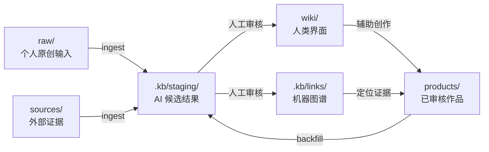

<div align="center">
  <h1>AI Content Knowledge Base</h1>
  <p><strong>面向研究、写作、教学与发布的 Review-first AI 原生知识库。</strong></p>
  <p>Markdown + Codex + Obsidian + 显式 YAML 关系图谱</p>
  <p>
    <a href="https://github.com/mrbear1024/ai-content-kb/stargazers"></a>
    <a href="LICENSE"></a>
    <a href="AGENTS.md"></a>
    <a href="https://obsidian.md/"></a>
  </p>
  <p><a href="README.md">English</a> · 简体中文</p>
</div>

---

> [!NOTE]
> **本项目受 [Andrej Karpathy 的 LLM Wiki 构想](https://gist.github.com/karpathy/442a6bf555914893e9891c11519de94f)启发而建立：** 该构想强调保留不可变的原始资料，由 LLM 增量维护一个持久、持续复利的 Markdown Wiki，并通过 `AGENTS.md` 等仓库 Schema 规定 Agent 如何 ingest、query 和维护知识。
>
> `ai-content-kb` 在这个思路上进一步增加了明确的来源角色、独立的发布作品层、Review-first staging、显式机器关系图谱、AI 内容创作工作流和旧知识库安全迁移方案。

普通知识库经常把个人判断、外部材料、已发布作品和 AI 生成文本混在一起。这个模板为每类内容定义清楚的角色，并让 AI Agent 在不污染原文和发布流程的前提下参与整理、查询与创作。

> **原文保持可信，Wiki 保持可读，图谱保持可查，AI 输出保持可审核。**


> 上图来自使用同一架构积累了大量内容后的知识库。刚 clone 的模板只有一组最小示例，图谱会随着笔记、审核后的链接和标签逐渐生长。

## 为什么使用这个项目

| 需求 | 设计方案 |
|---|---|
| 区分个人观点与外部主张 | 用 `raw/` 和 `sources/` 保存不同来源身份 |
| 复用已发布文章、课程和脚本 | 把审核后的输出作为独立 `products/` 层 |
| 方便人浏览，又不让摘要冒充证据 | `wiki/` 作为必须引用原文的人类界面 |
| 让 AI 理解精确关系 | `.kb/links/` 保存带类型、证据和 hash 的 YAML sidecar |
| 避免 AI 草稿自动成为正式知识 | 所有生成内容先进入 `.kb/staging/` |
| 在 Codex 中直接使用自然语言操作 | 根目录 `AGENTS.md` 提供持久工作流 |
| 不绑定单一软件 | 底层只使用 Markdown、YAML、JSON 和目录 |

## 快速开始

```bash
git clone https://github.com/mrbear1024/ai-content-kb.git
cd ai-content-kb
```

不安装任何应用也可以直接阅读。你可以使用普通 Markdown 工具、把根目录作为 Obsidian Vault 打开，或使用下面推荐的 Codex 工作流。

### 在 Codex 中打开

1. 打开 Codex 桌面应用。
2. 在左侧 **Projects** 区域点击 `+`。
3. 选择 **Use an existing folder**。
4. 选择 clone 后的仓库根目录。
5. 新建任务并输入：

```text
检查项目结构，读取知识库规则，不做修改，并告诉我可用的工作流。
```

Codex 会在开始工作前读取仓库的 `AGENTS.md`；根目录规则会继续引导它读取项目中的其他知识库规范。[查看 Codex 官方说明](https://learn.chatgpt.com/docs/agent-configuration/agents-md)。

> 下面的短语是本仓库定义的自然语言工作流，不是 Codex 原生 slash command，不需要安装插件。

## 直接对知识库说话

| 你说 | 默认结果 |
|---|---|
| `加入知识库：这是我的原创笔记` | 保存到 `raw/`，并生成待审核索引候选 |
| `加入知识库：把这个附件作为外部来源保存` | 保存到 `sources/`，记录来源并生成 staging 候选 |
| `增加 Wiki 索引：刚才的材料` | 在 staging 生成带引用的 Wiki 页面和关系 |
| `查询知识库：我有哪些关于……的材料？` | 从 Wiki 和图谱定位，回到原文并引用路径 |
| `在知识库中进行 AI 内容创作：写一篇关于……的文章` | 生成资料计划、大纲和带来源的 staging 草稿 |
| `迁移旧知识库：只读盘点这个目录` | 先生成盘点报告和映射，不修改旧库 |
| `审核并发布索引：<staging 路径>` | 校验并发布接受的 Wiki 与图谱候选 |
| `检查知识库` | 报告断链、引用、alias、hash 和隐私问题 |

## 工作原理



| 路径 | 职责 | 是否事实源 |
|---|---|---:|
| `raw/` | 原创笔记、判断、口述记录、自己的调研和创作草稿 | 是——个人意图 |
| `sources/` | 网页剪藏、论文、书摘、报告和外部媒体转写 | 是——外部主张 |
| `products/` | 已审核文章、课程、脚本和交付作品 | 是——已发布表达 |
| `wiki/` | 概念、实体、领域地图和高价值来源摘要 | 否——必须引用原文 |
| `.kb/links/` | 带证据和 hash 的已审核显式关系 | 可重建 |
| `.kb/staging/` | 未审核文章、Wiki、迁移映射和关系候选 | 否 |

详细说明见[架构设计](docs/ARCHITECTURE.md)和[图谱 Schema](docs/GRAPH_SCHEMA.md)。

## 核心工作流

### 收集与建立索引

```text
加入知识库：这个附件是一份外部来源。
保留来源信息，检查现有 alias，生成的 Wiki 和图谱数据先放入 staging。
```

在发布前检查 `.kb/staging/wiki/` 和 `.kb/staging/links/`。

### 在知识库中进行 AI 内容创作

```text
在知识库中进行 AI 内容创作：
写一篇面向 AI 产品经理的 Context Engineering 文章。
区分我的判断与外部主张，关键观点引用仓库路径，
先生成资料清单和大纲，不要直接写全文。
```

未审核正文进入 `.kb/staging/drafts/`；决定继续发展的内容进入 `raw/drafts/`；只有准备发布的作品才进入 `products/`。

[阅读 AI 内容创作完整指南](docs/CONTENT_CREATION_GUIDE.zh-CN.md)。

### 迁移旧知识库

```text
迁移旧知识库：只读盘点我提供的旧知识库目录。
不要移动、复制、删除或修改文件。
推荐 20～50 个文件作为首批试迁样本，然后等待我审核。
```

迁移流程为：备份 → 只读盘点 → 映射审核 → 小批量试迁 → 验证 → 分批扩大 → 切换。

[阅读旧知识库迁移完整指南](docs/MIGRATION_GUIDE.zh-CN.md)。

### 使用 Obsidian 浏览图谱

在 Obsidian 中选择 **Open folder as vault**，打开仓库根目录，然后点击左侧 **Graph view**。项目内置 `.obsidian/graph.json`，默认按 `raw`、`sources`、`products` 和 `wiki` 分组着色。

Obsidian 图谱展示 Markdown 链接和标签；`.kb/links/*.yaml` 是另一层供 AI 和脚本使用的机器关系，不会自动变成 Obsidian 连线。

## Review-first 生命周期

| 状态 | 位置 |
|---|---|
| 未审核文章或脚本 | `.kb/staging/drafts/` |
| 未审核课程大纲 | `.kb/staging/course-drafts/` |
| 未审核概念、实体、地图或来源摘要 | `.kb/staging/wiki/` |
| 未审核关系 sidecar | `.kb/staging/links/` |
| 人决定继续发展的草稿 | `raw/drafts/` |
| 已审核知识与关系 | `wiki/` 和 `.kb/links/` |
| 已审核、准备发布的作品 | `products/` |

决定内容位置的是**审核状态、预期用途、人类所有权和发布成熟度**，而不是“有没有使用 AI”。

## 文档

| 文档 | 用途 |
|---|---|
| [从这里开始](START_HERE.md) | 阅读顺序和核心边界 |
| [Agent 规则](AGENTS.md) | Codex 持久工作流与安全规则 |
| [知识库使用指南](KNOWLEDGE_BASE_GUIDE.md) | 面向人的日常操作原则 |
| [架构设计](docs/ARCHITECTURE.md) | 分层模型、生命周期和扩展路径 |
| [图谱 Schema](docs/GRAPH_SCHEMA.md) | YAML sidecar 字段和关系类型 |
| [AI 内容创作](docs/CONTENT_CREATION_GUIDE.zh-CN.md) | 调研、提纲、写作、审核和回填 |
| [旧库迁移](docs/MIGRATION_GUIDE.zh-CN.md) | 从现有 Obsidian 或 Markdown 知识库安全迁移 |
| [公开发布检查](docs/PUBLIC_RELEASE_CHECKLIST.md) | 隐私、密钥、版权和发布检查 |

## 项目定位

这是一个**参考架构和可运行模板**，不是托管式知识管理 SaaS。自动化功能有意保持克制：先用普通文件验证内容角色、来源追溯和审核流程，再根据真实查询需求增加 manifest、全文搜索、向量检索或图数据库。

Obsidian 和 Codex 都是可选界面；真正长期存在的是这个仓库及其规则。

## 贡献与支持

- 遇到问题或有新建议，可以[创建 Issue](https://github.com/mrbear1024/ai-content-kb/issues)。
- 欢迎改进信息模型、示例、Schema、lint 规则和文档的 Pull Request。
- 不要提交私人笔记、无权公开的完整版权材料、密钥、个人绝对路径或包含隐私元数据的数据库。
- 公开自己的 fork 前，请使用[公开发布检查表](docs/PUBLIC_RELEASE_CHECKLIST.md)。

由 [mrbear1024](https://github.com/mrbear1024) 和贡献者维护。

## License

[MIT](LICENSE)。本项目与 Obsidian 或 OpenAI 官方无隶属或背书关系。
