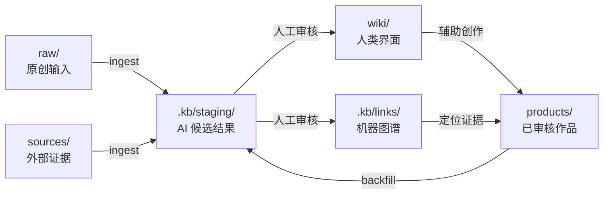

# AI Content Knowledge Base

简体中文 | [English](README.md)

一个基于 Markdown、Obsidian、YAML sidecar 和人工审核工作流的 AI 内容知识库参考架构。

它不是某个人公开出来的笔记合集，而是一套可复制的知识库骨架：将原创输入、外部证据、发布作品、人类知识索引和机器元数据分开管理。

> 核心思想：原文保持可信，Wiki 保持可读，图谱保持可查，AI 输出保持可审核。

## 为什么需要这套架构

大型内容库通常会混合多种性质完全不同的文件：

- 个人想法与判断；
- 外部文章、论文和转写；
- 已发布的文章、课程和脚本；
- AI 生成的总结与草稿；
- 帮助人理解和导航的知识索引。

如果把它们都当成普通笔记，观点归属、证据来源和审核状态就会变得模糊。这套模板为不同内容定义明确角色，并把 AI 批量输出隔离在事实源和发布流程之外。

## 总体架构

```text
raw/       个人原创输入
sources/   外部可引用材料
products/  已审核、已发布或已交付作品
wiki/      人类可读的概念、实体、地图和来源摘要
.kb/       机器图谱、待审核区、报告和日志
```



详细设计见 [架构说明](docs/ARCHITECTURE.md)。

## 快速开始

1. Clone 或复制本仓库。
2. 将仓库根目录作为 Obsidian Vault 打开，也可以直接使用普通 Markdown 工具。
3. 阅读 [START_HERE.md](START_HERE.md)。
4. 在 `raw/notes/` 中添加一条原创笔记。
5. 在 `sources/clips/` 中添加一份外部材料。
6. 让 AI Agent 遵循 [AGENTS.md](AGENTS.md) 执行 ingest。
7. 审核 `.kb/staging/` 中的候选结果，再决定是否进入正式层。

仓库内置了一条完整的合成示例：

- 外部来源：`sources/clips/example-source.md`；
- 概念页面：`wiki/concepts/Example Concept.md`；
- 图谱 sidecar：`.kb/links/sources/example-source.yaml`。

## 审核边界

```text
AI 未审核文章草稿     -> .kb/staging/drafts/
AI 未审核关系数据     -> .kb/staging/links/
人决定继续发展的草稿 -> raw/drafts/
已审核知识页面        -> wiki/
已审核关系数据        -> .kb/links/
已审核发布作品        -> products/
```

内容位置不由“是不是 AI 写的”简单决定，而取决于审核状态、预期用途、人类所有权和发布成熟度。

## 目录结构

```text
.
├── AGENTS.md
├── CLAUDE.md
├── START_HERE.md
├── KNOWLEDGE_BASE_GUIDE.md
├── README.md
├── README.zh-CN.md
├── LICENSE
├── docs/
│   ├── ARCHITECTURE.md
│   ├── GRAPH_SCHEMA.md
│   └── PUBLIC_RELEASE_CHECKLIST.md
├── raw/
│   ├── notes/
│   ├── voice/
│   ├── research/
│   └── drafts/
├── sources/
│   ├── clips/
│   ├── papers/
│   ├── books/
│   ├── reports/
│   └── media/
├── products/
│   ├── articles/
│   ├── courses/
│   └── media/
├── wiki/
│   ├── concepts/
│   ├── entities/
│   ├── maps/
│   └── sources/
└── .kb/
    ├── links/
    ├── staging/
    ├── reports/
    ├── logs/
    └── metadata/
```

## 三个关键设计

### 1. Source-first

`raw/`、`sources/` 和 `products/` 分别承担不同的事实源角色。`wiki/` 是索引和综合，不能反过来替代原始证据。

### 2. Wiki 给人读，Links 给机器查

Obsidian 双链适合浏览，但难以稳定表达关系类型、证据、置信度、审核状态和 source hash。因此，机器关系以独立 YAML sidecar 保存，不批量改动原文和发布作品。

### 3. Staging-first

AI 输出生成成本低，但信任成本高。所有批量生成结果先进入 `.kb/staging/`，经人工审核后才进入 Wiki、正式图谱或发布层。

## 关系类型

第一版使用一组克制的显式关系：

- `mentions`：提到概念或实体；
- `explains`：系统解释概念；
- `uses`：作品使用概念或方法；
- `derived_from`：翻译、改编或派生自另一来源；
- `part_of`：章节属于课程或集合；
- `related_to`：存在有意义的关联；
- `alias_of`：别名指向规范对象。

完整格式见 [图谱 Schema](docs/GRAPH_SCHEMA.md)。

## 项目不是什么

- 它是参考架构和模板，不是已经完成的知识管理 SaaS。
- Obsidian 不是必需依赖，底层仍是普通文件。
- YAML 是第一版图谱表示，不代表永远不使用数据库。
- AI 自动生成的页面不会自动成为可信知识。
- 页面数量和双链数量不是成功指标。

## 如何衡量是否有效

一个有效实现应当能够回答：

- 哪些来源只是提到某概念，哪些来源系统解释了它？
- 哪些已发布作品使用过某个观点？
- 某个判断来自个人输入还是外部证据？
- 哪些课程章节覆盖了某个概念？
- 哪些来源在图谱审核后发生了变化？
- Wiki 中的重要判断能否回到原始文件？

## 公开发布前

不要把本地挂载路径、私人笔记、完整版权材料、密钥、日志或包含个人元数据的数据库提交到公开仓库。请先完成[公开发布检查表](docs/PUBLIC_RELEASE_CHECKLIST.md)。

## License

MIT，详见 [LICENSE](LICENSE)。

本项目与 Obsidian 官方无隶属或背书关系。
